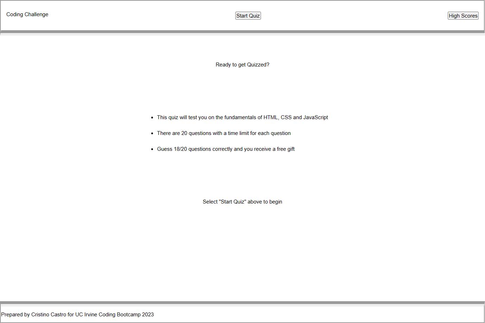
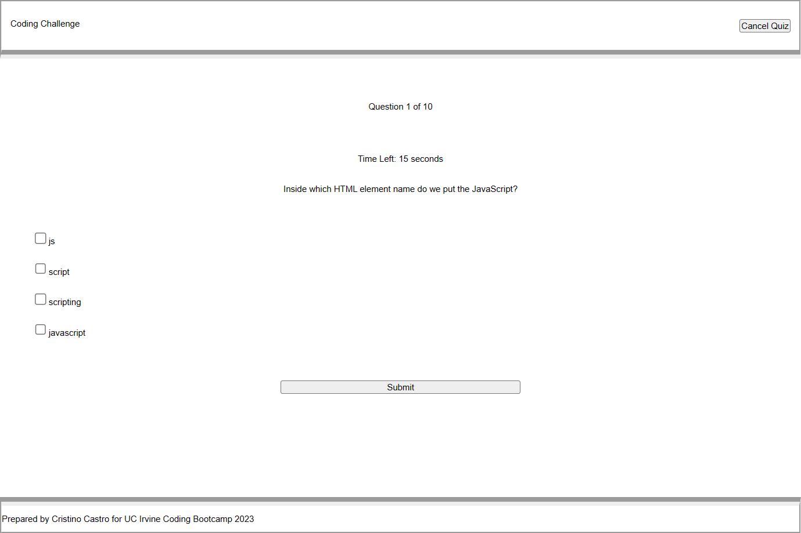

# 4-web-coding-quiz
Take a quiz to test your skills! Covering CSS,HTML, and JavaScript, this quiz will test your knowledge.

## Description
This application runs a 10-question quiz on JavaScript. Select "Start Quiz" to begin the quiz and then select the checkboxes to submit your answer to each question. 

## Accessing the Application
The application can be accessed on the GitHub repo here: https://github.com/cristino4/4-web-coding-quiz

The applicaiton is also available on its published site: https://cristino4.github.io/4-web-coding-quiz/

To run the application locally, download the applications files and open the index.html file on any web browser.

## Screenshot of the application

